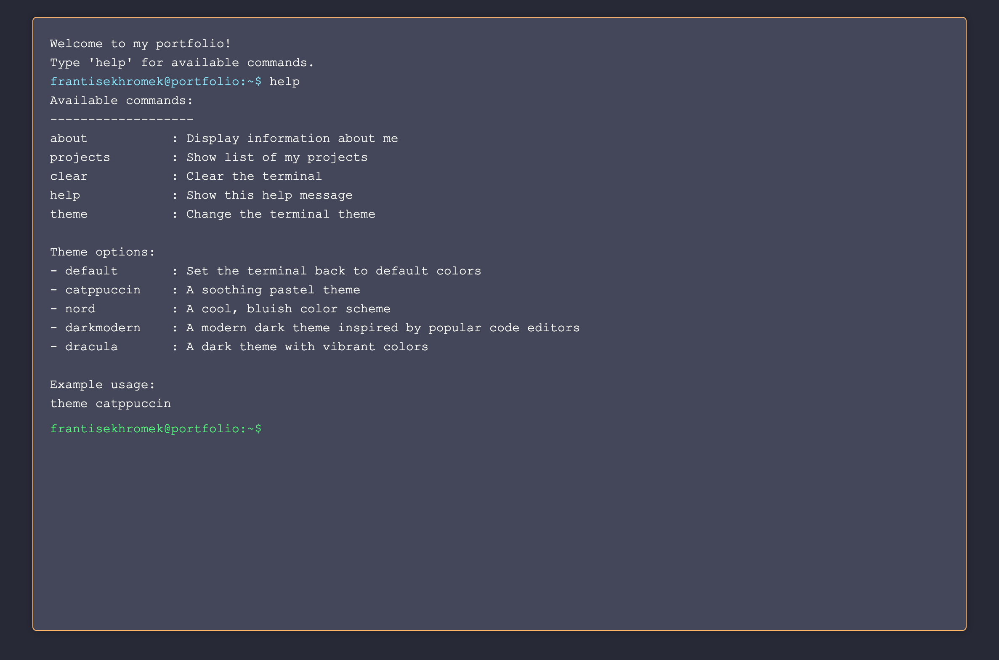

```markdown
# Terminal-Style Portfolio Website



## Overview

This project is a unique, interactive terminal-style portfolio website. It simulates a command-line interface in the browser, allowing visitors to explore your portfolio using familiar terminal commands. The website features customizable themes and dynamic content loading, providing an engaging and memorable experience for potential employers or clients.

## Features

- **Command-Line Interface**: Navigate the portfolio using text commands.
- **Dynamic Content Loading**: Asynchronously load content for different sections.
- **Customizable Themes**: Switch between multiple color schemes on-the-fly.
- **Responsive Design**: Works well on both desktop and mobile devices.
- **Easy to Extend**: Simple structure makes it easy to add new commands and features.

## Available Commands

- `about`: Display information about you
- `projects`: Show a list of your projects
- `clear`: Clear the terminal screen
- `help`: Show available commands
- `theme <name>`: Change the terminal theme

## Themes

- `catppuccin`: A soothing pastel theme
- `nord`: A cool, bluish color scheme
- `darkmodern`: A modern dark theme inspired by popular code editors

```
